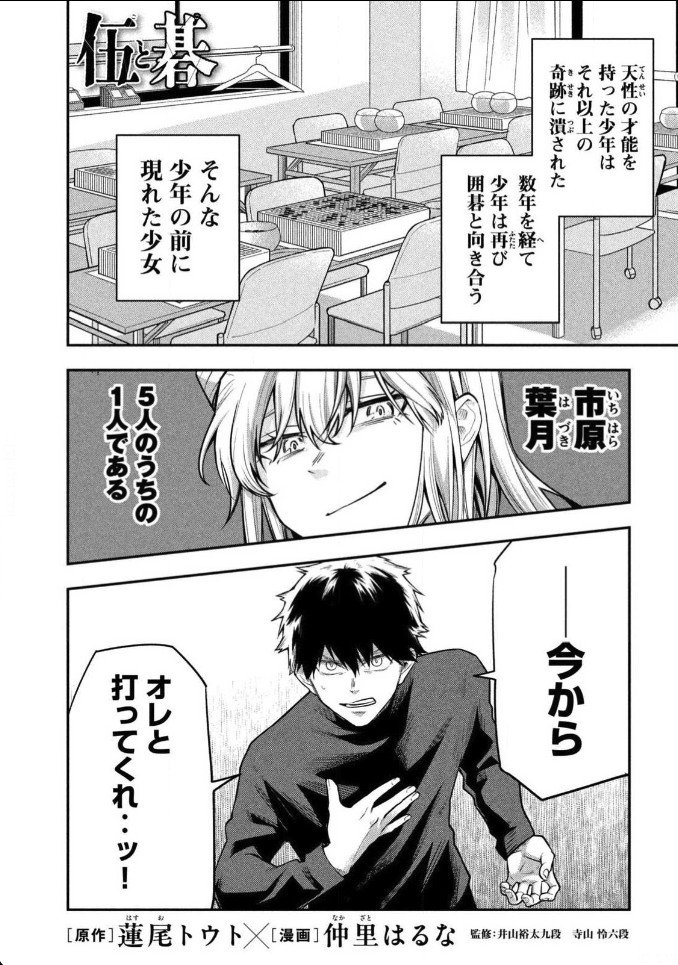
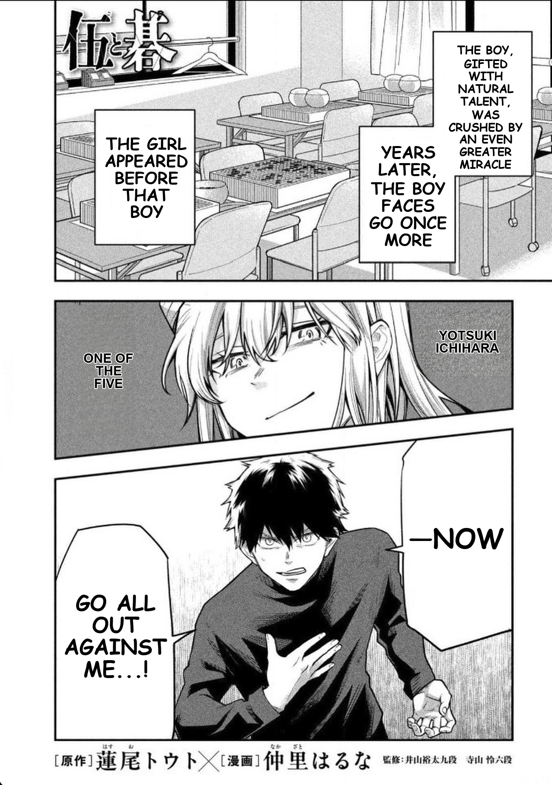
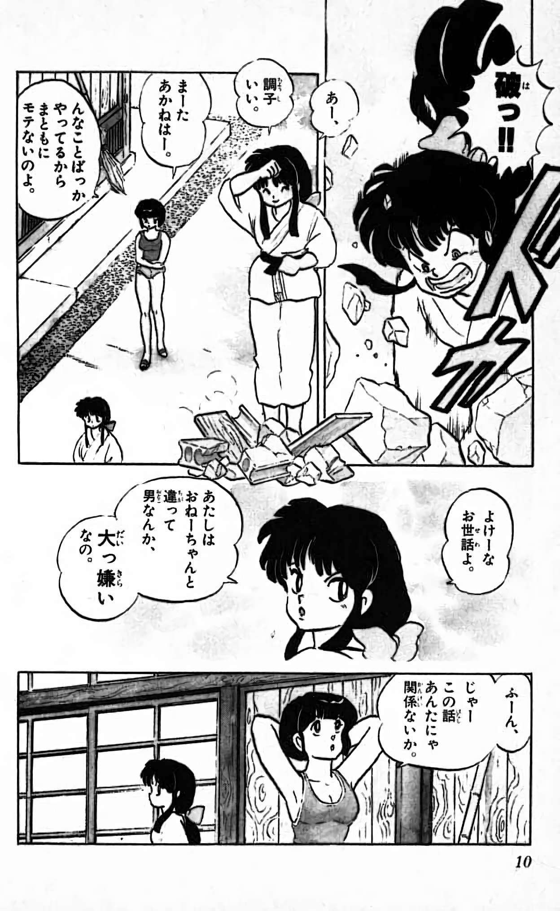
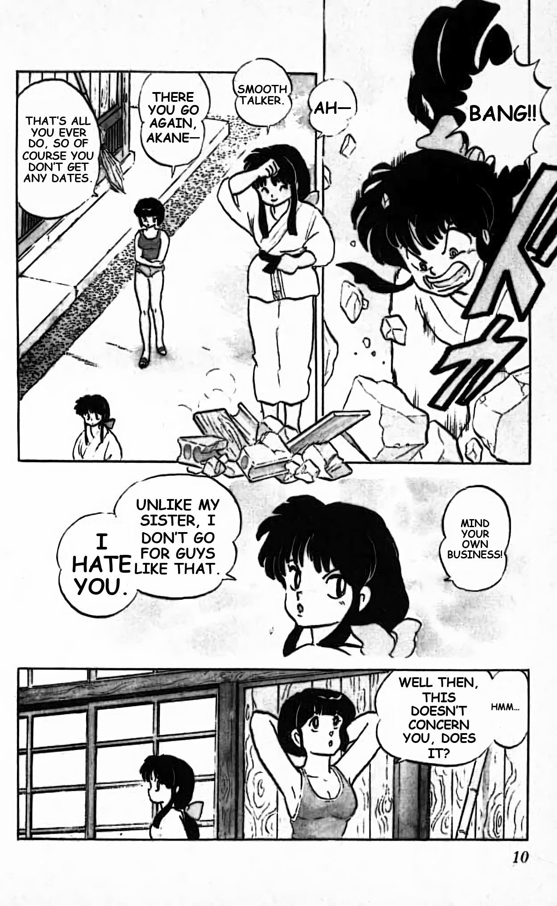
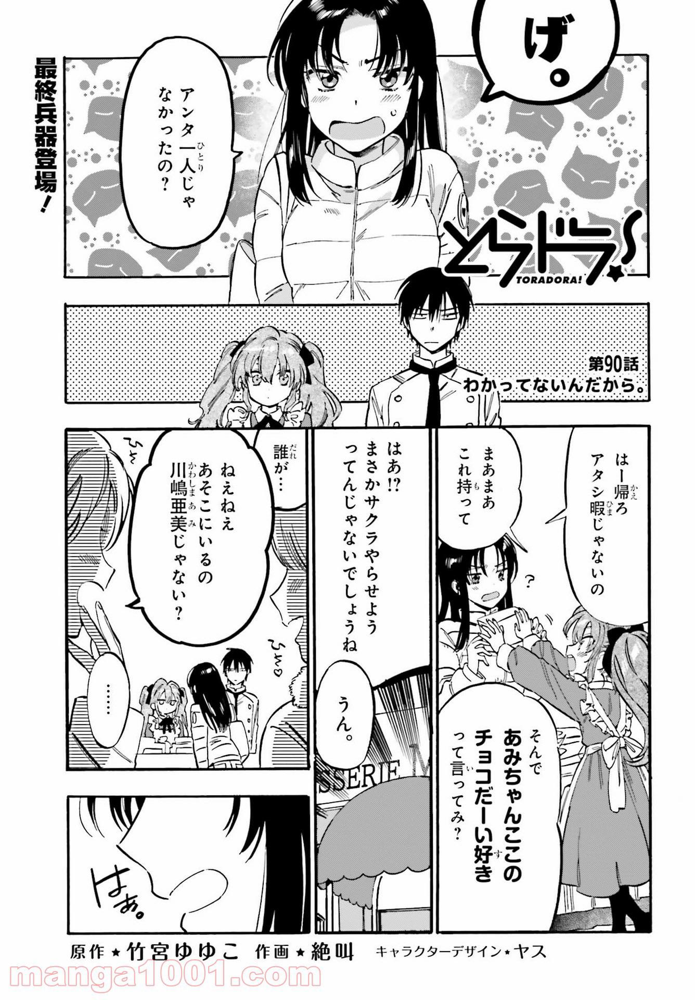
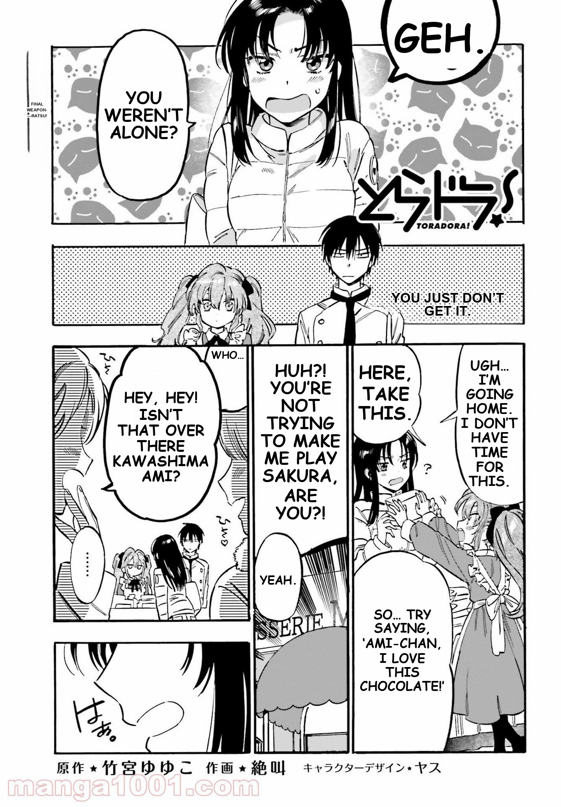

# Free Manga Translator

Free Manga Translator is a local manga, manhwa, and manhua translation system with a browser extension frontend and an 8-stage image pipeline backend. It detects source text, builds layout constraints, translates text, cleans the source artwork, and typesets English back into the page.

## Features

- Local FastAPI backend for image translation.
- Chrome and Brave extension for browser-based page translation.
- OCR, layout analysis, speech-bubble handling, floating-text handling, inpainting, and typesetting.
- API-key translation support through `core_pipeline/.env`.
- Local model assets tracked with Git LFS.
- Minimal repository layout without QA dumps, runtime caches, validation folders, or checkpoints.

## Repository Layout

```text
core_pipeline/
  backend_api/       Local API service.
  extension/         Chrome and Brave extension.
  models/            Required model assets.
  python/common/     Shared pipeline utilities.
  python/runtime/    Runtime orchestration.
  python/steps/      Step 4-8 pipeline stages.
docs/                Architecture and user guide.
examples/            README input/output examples.
```

## Requirements

- Windows 10 or Windows 11.
- Python 3.11 or newer.
- CUDA-capable NVIDIA GPU recommended.
- Git LFS.
- Chrome or Brave.

## Setup

```powershell
git clone https://github.com/Lin-2352/Free-Manga-Translator.git
cd "Free Manga Translator"
git lfs install
git lfs pull
python -m venv .venv
.\.venv\Scripts\Activate.ps1
pip install -r requirements.txt
copy core_pipeline\.env.example core_pipeline\.env
```

Add your translation provider keys to `core_pipeline/.env`.

## Run The Backend

```powershell
cd "Free Manga Translator\core_pipeline"
$env:PYTHONIOENCODING='utf-8'
$py="..\.venv\Scripts\python.exe"
& $py -m uvicorn backend_api.app.main:app --host 127.0.0.1 --port 8766
```

Health check:

```powershell
curl http://127.0.0.1:8766/v1/health
```

## Load The Extension

1. Open `chrome://extensions` or `brave://extensions`.
2. Enable Developer mode.
3. Click Load unpacked.
4. Select `core_pipeline/extension`.
5. Start the backend.
6. Open a manga page and use the extension popup to translate.

## Examples

### Sample 4

Input:



Output:



### Sample 5

Input:



Output:



### Sample 6

Input:



Output:



## Notes

- Do not commit `core_pipeline/.env`.
- Runtime folders, validation reports, diagnostics, and test runs are intentionally excluded.
- Keep Git LFS enabled before cloning or pulling model assets.
