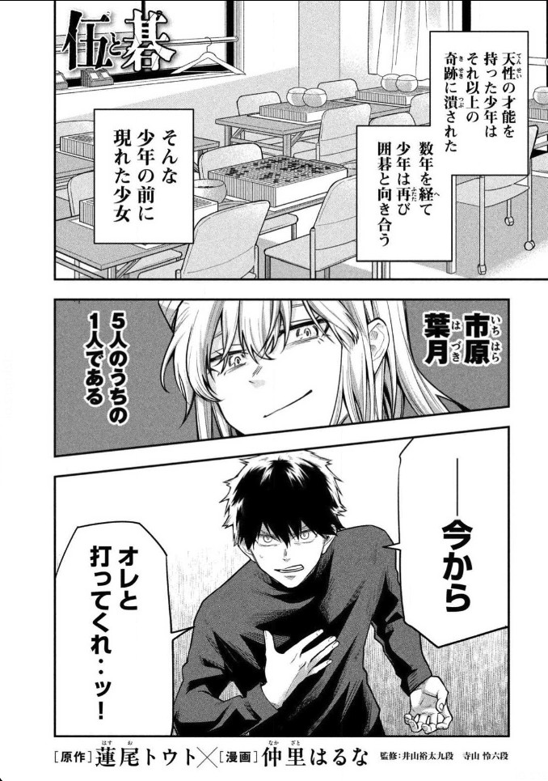
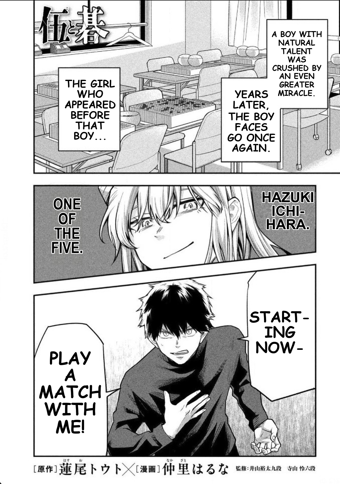
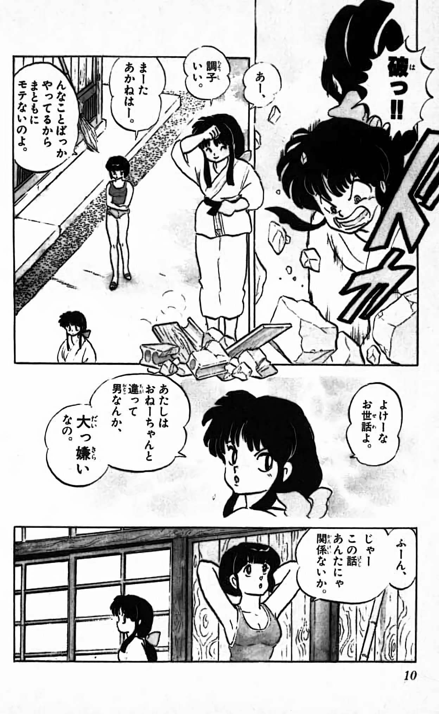
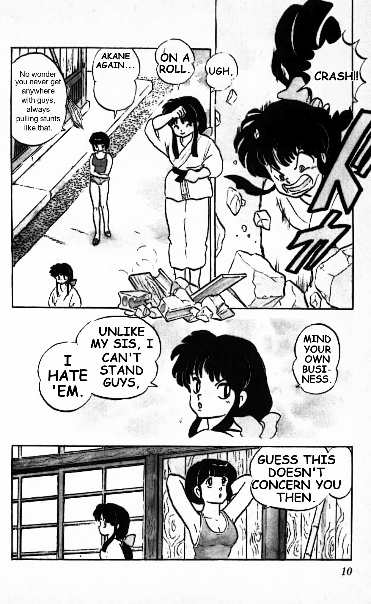
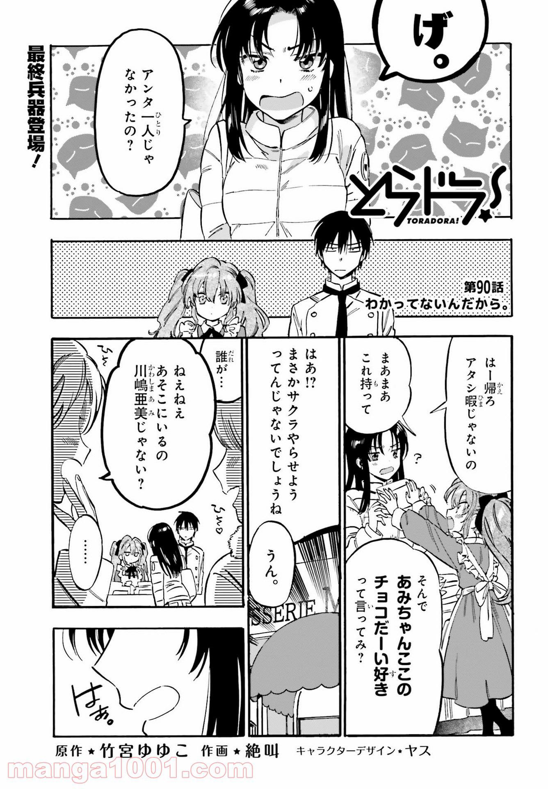
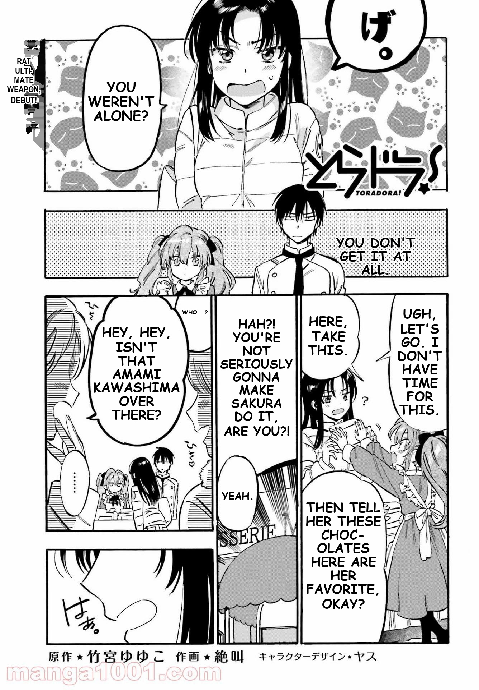

# Free Manga Translator

Free Manga Translator is a local manga, manhwa, and manhua translation system with a browser
extension frontend and an 8-stage image pipeline backend. It detects source text, builds layout
constraints, translates text, cleans the source artwork, and typesets English back into the page —
entirely on your own machine.

## Features

- Local FastAPI backend for image translation; the browser never runs OCR, inpainting, or model
  inference itself.
- Chrome and Brave extension: auto-translate a page, translate on demand, or select a single panel.
- Queue-ahead and adaptive parallel-job controls, with a GPU-VRAM-aware scheduler that keeps
  requests safe on lower-memory GPUs.
- Live provider quota and GPU VRAM telemetry in the popup, plus one-click GPU release.
- Session-based translation cache with configurable retention and a one-click clear.
- OCR, layout analysis, speech-bubble handling, floating-text handling, inpainting, and typesetting
  across Japanese, Korean, and Chinese source text.
- Optional multi-provider API-key translation (through `core_pipeline/.env`) with automatic
  fallback across providers; works with no keys configured too, using local translation.
- Local model assets tracked with Git LFS.
- Minimal repository layout — no QA dumps, runtime caches, validation folders, or checkpoints.

## Repository Layout

```text
core_pipeline/
  backend_api/       Local FastAPI service.
  extension/         Chrome and Brave extension.
  models/            Required model assets (Git LFS).
  python/common/     Shared pipeline utilities.
  python/runtime/    Runtime orchestration for the extension's local pipeline server.
  python/steps/      Step 4-8 pipeline stages.
docs/                Architecture and user guide.
examples/            README input/output examples.
```

## Requirements

- Windows 10 or Windows 11.
- Python 3.11 or newer.
- CUDA-capable NVIDIA GPU recommended (the pipeline runs on CPU otherwise, but much slower).
- Git LFS.
- Chrome or Brave.

## Setup

```powershell
git clone https://github.com/Lin-2352/Free-Manga-Translator.git
cd "Free Manga Translator"
git lfs install
git lfs pull
python -m venv .venv
.\.venv\Scripts\Activate.ps1
pip install -r requirements.txt
copy core_pipeline\.env.example core_pipeline\.env
```

torch/torchvision need a CUDA build, not the plain PyPI wheel:

```powershell
pip install torch==2.6.0 torchvision==0.21.0 --index-url https://download.pytorch.org/whl/cu124
```

Add your translation provider keys to `core_pipeline/.env` (optional — see `.env.example` for
every supported provider and its config). Without any keys, the pipeline falls back to local
translation.

## Run The Backend

```powershell
cd "Free Manga Translator\core_pipeline"
.\start_backend.ps1
```

Or run it directly:

```powershell
cd "Free Manga Translator\core_pipeline"
$env:PYTHONIOENCODING='utf-8'
..\.venv\Scripts\python.exe -m uvicorn backend_api.app.main:app --host 127.0.0.1 --port 8766
```

Health check:

```powershell
curl http://127.0.0.1:8766/health
```

## Load The Extension

1. Open `chrome://extensions` or `brave://extensions`.
2. Enable Developer mode.
3. Click Load unpacked.
4. Select `core_pipeline/extension`.
5. Start the backend (above).
6. Open a manga page, open the extension popup, and click **Start Engine** to confirm the backend
   is reachable — then **Translate Page** or enable **Auto Translate**.

No GPU? Run the backend on Kaggle's free T4 instead — see `docs/KAGGLE_USER_MANUAL.md`.

## Examples

### Sample 1

Input:



Output:



### Sample 2

Input:



Output:



### Sample 3

Input:



Output:



## Notes

- Do not commit `core_pipeline/.env` — it can hold live API keys.
- Runtime folders, validation reports, diagnostics, and test runs are intentionally excluded from
  this repository.
- Keep Git LFS enabled before cloning or pulling model assets.
- The backend only accepts requests carrying the extension's client header; it is not intended to
  be exposed beyond `127.0.0.1`.
